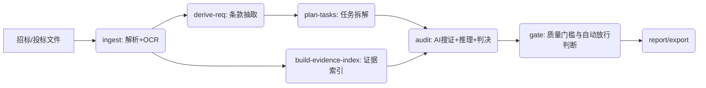

# Smart Tender Agent (STA) L3 架构设计（可执行版）

本文档用于指导当前 `bidagent` 项目向 L3 自动审查演进。

核心理念：
- AI 自主拆解任务
- AI 主动搜集证据
- AI 推理并给出判决

目标定位：
- L3 级自动审查：AI 完成 >=95% 初审，人类只处理“存疑项”和最终签字。

## 1. L3 Definition Of Done

必须同时满足以下门槛才允许“自动定稿”：

1. 自动初审覆盖率 >=95%
2. hard_fail_recall >=0.98
3. false_positive_fail <=1%
4. 证据可追溯率 >=99%（结论必须可回溯到页码或块定位）
5. LLM 覆盖率 =100%（AI 模式下，所有 requirement 都有 LLM 判决记录）

若任一门槛不达标：
- 自动降级为“建议报告”，禁止自动定稿。

## 2. 总体架构（Pipeline + Stateful）



设计原则：
- 每阶段中间态持久化，支持断点续跑与回放调试。
- 判决与证据分离存储，便于复核和回归评测。
- 输出结构化决策链，不依赖“自然语言解释”作为唯一依据。

## 3. 命令设计（与现有 bidagent 对齐）

推荐保留现有命令并扩展，不另起一套 CLI。

| 阶段 | 现有命令 | 新增/增强点 | 核心输出 |
| --- | --- | --- | --- |
| 解析 | `ingest` | OCR 强制可用性校验、图片证据入库 | `ingest/*.jsonl`, `manifest.json` |
| 条款 | `extract-req` | 强制 source clause 锚点 | `requirements.jsonl` |
| 拆解 | `plan-tasks`(新增) | requirement -> review tasks | `review-tasks.jsonl` |
| 搜证 | `build-index`(新增) | 稀疏/结构/OCR 混合索引 | `evidence-index/*` |
| 判决 | `review`(重构) | LLM 主审，规则做护栏 | `verdicts.jsonl` |
| 放行 | `gate`(新增) | 门槛校验、自动定稿开关 | `gate-result.json` |
| 报告 | `report` | 同时输出建议版/定稿版 | `review-report.md`, `final-report.*` |
| 评估 | `eval` | 金标评测 + 阈值硬失败 | `eval/metrics.json` |

执行示例（使用 `uv`）：

```bash
uv run bidagent run --tender "<tender>" --bid "<bid>" --out runs/l3 --ocr-mode auto --ai-provider deepseek
uv run bidagent eval --out runs/l3
```

## 4. 数据协议（Protocol）

### 4.1 文档块 `ingest/*_blocks.jsonl`

必须包含：
- `doc_id`
- `text`
- `location.block_index`
- `location.page`（若可得）
- `location.section`
- `source_type`（text|table|ocr_image）

### 4.2 条款 `requirements.jsonl`

必须包含：
- `requirement_id`
- `text`
- `category`
- `rule_tier`（hard_fail|scored|general）
- `source.doc_id`
- `source.location`
- `source.excerpt_hash`

### 4.3 任务 `review-tasks.jsonl`（新增）

每条 requirement 拆成 2-6 个可执行任务：

```json
{
  "task_id": "T-R0007-02",
  "requirement_id": "R0007",
  "task_type": "amount_check",
  "query": "验证投标保证金是否不少于50万元",
  "expected_logic": {"op": ">=", "value": 500000, "unit": "CNY"},
  "priority": "hard_fail"
}
```

### 4.4 证据包 `evidence-pack.jsonl`（新增）

```json
{
  "task_id": "T-R0007-02",
  "candidates": [
    {
      "evidence_id": "E-bid-p45-b221",
      "doc_id": "bid",
      "location": {"page": 45, "block_index": 221},
      "excerpt": "汇款金额：人民币伍拾万元整",
      "score": 0.91,
      "quality": {"ocr_confidence": 0.88, "is_reference_only": false}
    }
  ]
}
```

### 4.5 判决 `verdicts.jsonl`（新增）

状态统一为：
- `pass`
- `risk`
- `fail`
- `needs_ocr`
- `insufficient_evidence`

```json
{
  "task_id": "T-R0007-02",
  "requirement_id": "R0007",
  "status": "pass",
  "confidence": 0.96,
  "reason": "保证金金额满足下限要求",
  "evidence_refs": ["E-bid-p45-b221"],
  "counter_evidence_refs": [],
  "model": {"provider": "deepseek", "name": "deepseek-chat"},
  "decision_trace": {"source": "llm_primary", "fallbacks": []}
}
```

## 5. 判决状态机（L3 关键）

规则：
1. `pass` 需要高置信且证据充分。
2. `fail` 需要明确反例或硬性缺失证据。
3. `risk` 用于低置信或冲突证据。
4. `needs_ocr` 用于仅命中“附件/扫描件引用”且图像证据未解析。
5. `insufficient_evidence` 用于证据不足但不能直接判 fail。

聚合到 requirement 时：
- 任一 hard_fail 任务为 `fail` -> requirement 为 `fail`
- 多任务冲突 -> `risk`
- 仅引用型证据 -> `needs_ocr`
- 无足够证据 -> `insufficient_evidence`

## 6. 自动放行与降级策略

`gate` 阶段统一判断：

- 达标：输出 `release_mode=auto_final`
- 不达标：输出 `release_mode=assist_only`

门槛计算来源：
- `eval/metrics.json`
- `verdicts.jsonl` 汇总
- `review-report.md` 统计

## 7. 多智能体协作（可选，不是第一优先）

先做单主智能体闭环，再考虑多智能体：

- `Planner Agent`：拆任务
- `Reviewer Agent`：搜证与判决
- `Auditor Agent`：反证检查与一致性复核

约束：
- Agent 间只传结构化 JSON
- 每步有硬校验，不通过就回退重试

## 8. 可观测性与审计

必须落库：
- 每条 requirement 的 LLM 调用次数、耗时、失败原因
- 每条 verdict 的证据链
- 每次 run 的模型版本与 prompt 版本

建议输出：
- `run-metadata.json`
- `trace/*.jsonl`

## 9. 与当前仓库的重构路线

### Phase 1（可在当前代码上快速落地）
1. 新增 `review-tasks.jsonl` 与 `verdicts.jsonl`
2. `review` 改为 LLM 主判，规则仅做 guardrail
3. 强制 AI 模式下 `llm` 不能为空
4. 增加 `gate` 命令与自动放行判断

### Phase 2
1. 引入 `build-index`（结构化 + OCR 证据索引）
2. 实现任务级主动搜证
3. 增加冲突证据与反证机制

### Phase 3
1. 扩展金标集（>=200 条）
2. 以指标驱动调优并设硬阈值
3. 达标后启用 `auto_final`

## 10. 验证工作流

1. `uv sync`
2. `uv run bidagent run ...`
3. `uv run bidagent eval --out runs/<x>`
4. 检查 `gate-result.json` 是否 `auto_final`
5. 未达标则回归到 `assist_only`，仅输出建议报告

---

本设计将“能跑通”升级为“可审计、可评测、可放行”的 L3 工程方案。
